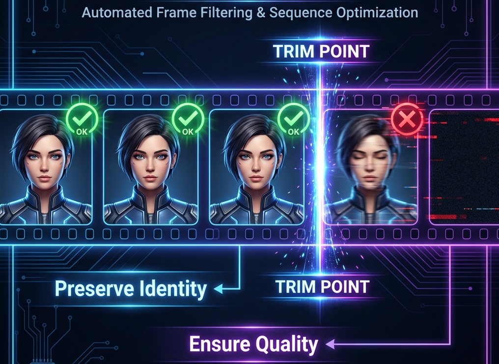

# ComfyUI-I2VChainHelper



A ComfyUI custom node designed to help filter and trim image batches for consistent Image-to-Video (I2V) chaining.

## Problem Statement
When chaining video generations (using the last frame of one video to start another), the quality and identity consistency of the last frame is critical. If the last frame has a motion-blurred face, closed eyes, or loses the subject's identity, the next generation will likely drift away from the original person.

## Solution
`I2VChainHelper` analyzes an image batch (the output of a previous generation) and trims it to the last frame that satisfies specific criteria:
1. **Face Similarity**: Ensures the person in the frame still matches the reference person (the first frame of the batch).
2. **Eye Openness**: Ensures the eyes are sufficiently open (using Eye Aspect Ratio - EAR), which is important for starting clear video generations.

## Installation

1. Copy this folder to your ComfyUI `custom_nodes` directory.
2. Install dependencies:
```bash
pip install -r requirements.txt
```
3. Ensure you have `ComfyUI-FaceAnalysis` or a compatible model loader to provide the `ANALYSIS_MODELS` input.

## Nodes

### I2V Chain Helper
- **Inputs**:
    - `images`: Image batch.
    - `analysis_models`: Face analysis models (InsightFace or DLib).
    - `min_face_similarity`: Minimum cosine similarity to the reference face (default: 0.5).
    - `min_eyes_openness`: Minimum EAR score for open eyes (default: 0.4).
    - `reference_image` (optional): If provided, use this image as the identity reference instead of the first frame of the batch.
- **Outputs**:
    - `trimmed_images`: The filtered and potentially shortened batch.
    - `frame_count`: Number of images in the trimmed batch.
    - `first_frame`: The first image of the trimmed batch (for convenience).
    - `last_frame`: The last "good" image of the trimmed batch (useful for I2V chaining).
    - `face_similarity`: The face similarity score of the last good frame (0..1).
    - `eyes_openness`: The eye openness (EAR score) of the last good frame.

## License
This project is licensed under the MIT License - see the [LICENSE](LICENSE) file for details.
